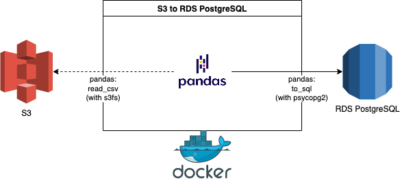

# Data Transfer from S3 to RDS PostgreSQL with Pandas
##### This repo contains an example Docker container that transfers data from S3 file(s) into a RDS PostgreSQL table by using Pandas and S3FS.
The goal of this example is to provide a simple solution to a common ("database import") task.

### Workflow Overview

***

